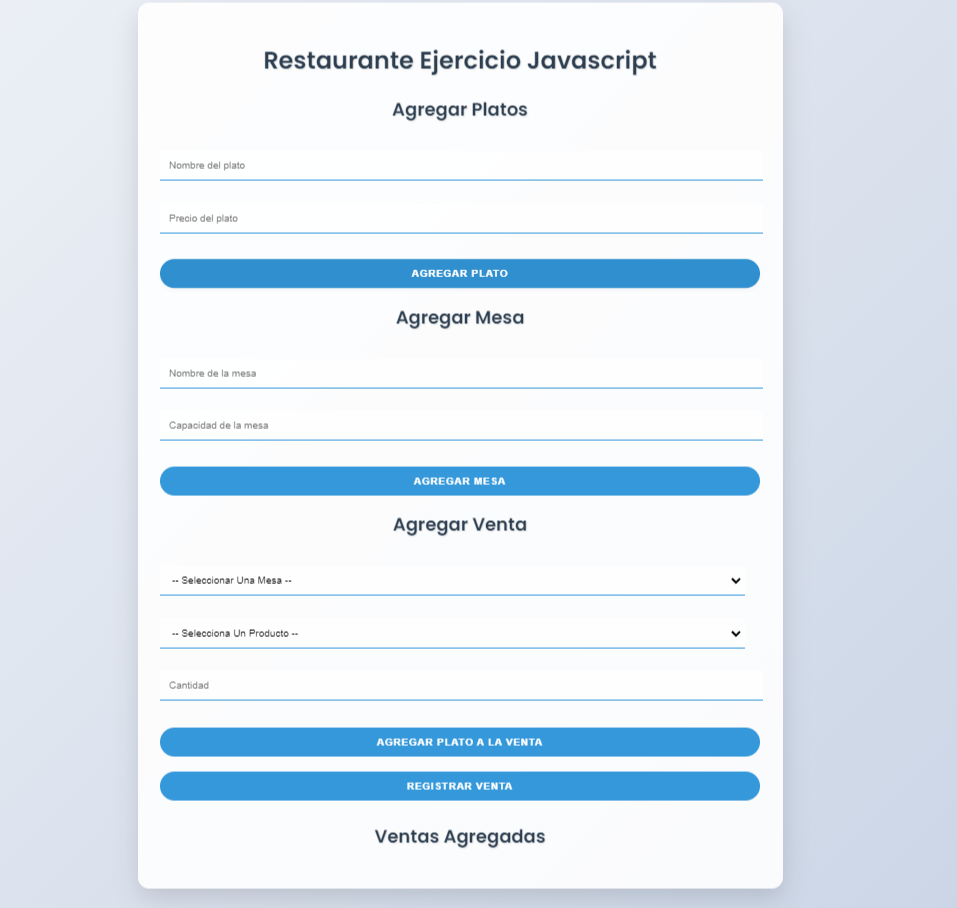

# Ejercisio De Practica De Javascript

El sistema está desarrollado con HTML, CSS y JavaScript.

---

## Características principales

### Gestión de platos
- Registrar platos con nombre y precio.
- Validación de datos para evitar entradas incorrectas.
- Actualización dinámica del menú disponible.

### Gestión de mesas
- Registrar mesas con nombre y capacidad.
- Asignación automática para registrar ventas.

### Gestión de ventas
- Seleccionar productos y mesas para registrar pedidos.
- Añadir cantidades y calcular el total en tiempo real.
- Generar un historial de ventas detallado para cada mesa.

---

## Tecnologías utilizadas

- **HTML5:** Estructura de la aplicación.
- **CSS3:** Estilización con animaciones y diseño responsivo.
- **JavaScript:** Manejo dinámico del DOM, validaciones y lógica.

## Cómo usar
1. **Registrar platos:** Introduce el nombre y precio, luego haz clic en *Agregar plato*.
2. **Registrar mesas:** Introduce el nombre y capacidad, luego haz clic en *Agregar mesa*.
3. **Registrar ventas:**
   - Selecciona un plato y mesa.
   - Indica la cantidad.
   - Haz clic en *Agregar venta temporal*.
   - Para finalizar, haz clic en *Registrar venta*.
4. **Historial:** Visualiza las ventas por mesa con detalles completos y totales.

## Imagen Representativa
